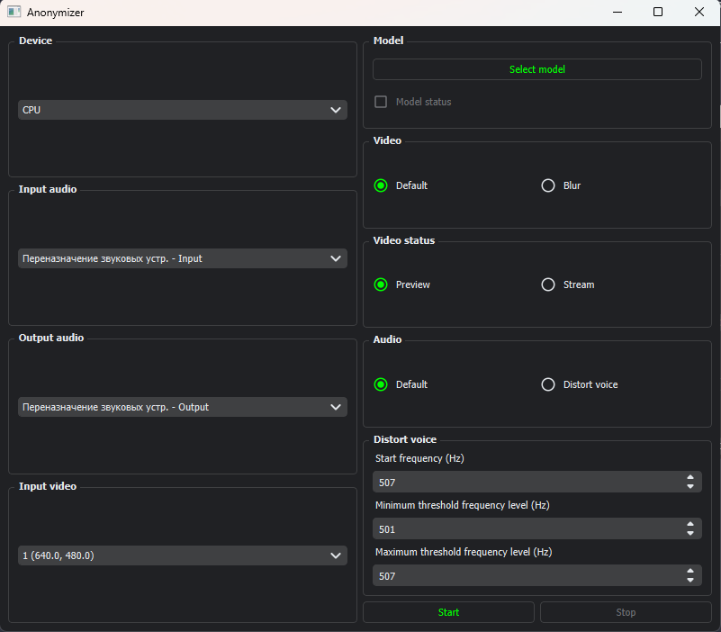
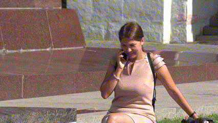

# Face_anonymizer

This is a program that blurs your face and changes your voice in real time.

The converted video and audio can be used in OBS, Discord, Zoom and other programs.

### Program interface



### Video

__To use blur you need to download the [YOLOV8-face](https://github.com/derronqi/yolov8-face) model.__

__If you have Nvidia video cards with support for CUDA cores, then you can select "Device" in the list to speed up face recognition and blurring.__

Default



Blur


### Audio

Default


Distort voice


*P.S. Voice taken from YouTube channel Uldan Dub*

### Information

__The quality of the result depends on the specified frequency Hz.__

Also, the audio frequency will change randomly in the ranges from and to.


### Installation

```
pip install -r requirements.txt
```

### Launch

```
python main.py
```
